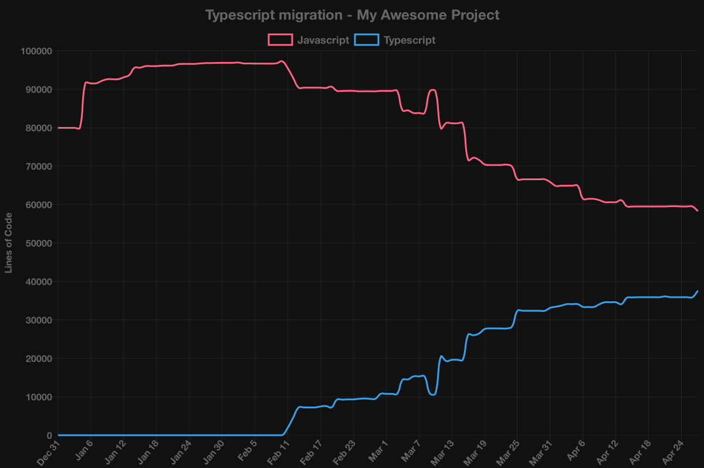

# ts-reporter 🚲

Migrating your huge app from Javascript to Typescript? This project provides a burndown chart (as a `.png`, along with raw `.json`) of your remaining LOC to convert!

- See the progress that you're making instead of feeling like you're getting nowhere. 💪
- Easily integrate as an artifact of your CI
- 🌌 Dark mode! `--dark`



## Install in project

```sh
yarn add ts-reporter --dev
# or
npm i ts-reporter --save-dev
```

`package.json`:

```json
{
  "scripts": {
    "build-ts-reporter": "ts-reporter build src/"
  }
}
```

3. Run

```sh
npm run build-ts-reporter
# or
yarn build-ts-reporter

# or directly, without adding to package.json:
npx ts-reporter build src/
```

## Install globally

```sh
yarn global add ts-reporter
# or
npm i --global ts-reporter
```

```sh
ts-reporter build src/
```

## Run as part of build

### Azure Devops

Install ts-reporter:

```sh
yarn add --dev ts-reporter
#or
npm i --save-dev ts-reporter
```

Add to `azure-pipelines.yml`:

```yml
# [...]

- job: ts_reporter
  container: node:15
  steps:
    - checkout: self
      fetchDepth: 1000
    - script: |
        npm ci
      displayName: Install
    - script: |
        git checkout -- .
        npx ts-reporter build src
      displayName: Run ts-reporter
    - task: PublishPipelineArtifact@1
    inputs:
        targetPath: $(System.DefaultWorkingDirectory)/reports
        artifactName: reports
# [...]
```

### Something else?

PRs welcome for documentation!

## FAQ

### Why is my CI failing to `npm install`?

If your build agent is using node v16, you might need to use node v15. [node-canvas](https://github.com/Automattic/node-canvas) doesn't support prebuilts of node v16 as of the time of this writing.

> npm ERR! node-pre-gyp WARN Pre-built binaries not found for canvas@2.7.0 and node@16.0.0 (node-v93 ABI, glibc) (falling back to source compile with node-gyp)
